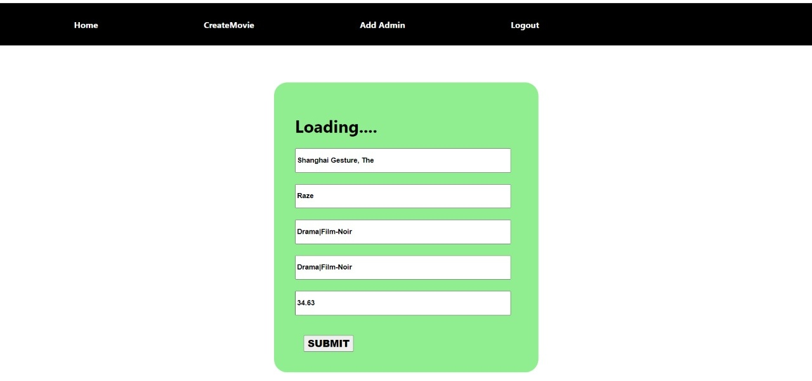

# Notion_Infosot_Assignment

# Admin email- saurabhkumar.me24@gmail.com,

# Admin password:-> abc

 

- <h2> Base_URL</h2>
  <a>https://infoset-backend.herokuapp.com/</a>

  # Admin Login

  - <h2> Method:Post</h2>

url:- Base_URL + admin/login
 

  <h2 style="color:red">body<h2> 
  { 

"a_email":"saurabhkumar.me24@gmail.com", 
"a_password":"abc" 

}
 

<h2 style="color:red">response</h2> 
{ 

    "status": true, 
      "admin": {  
        "_id": "62d134ea6a6032910b94f15d",  
        "a_firstName": "Saurabh Kumar",  
        "a_lastName": "Bhardwaj",  
        "a_email": "saurabhkumar.me24@gmail.com",  
        "a_password": "abc",  
        "__v": 0  
    }  
}  
  
 

# Admin Register

- <h2> Method:Post<h2>

url:- Base_URL + admin/create
 

  <h2 style="color:red">body<h2> 
  { 
 "a_firstName": "Saurabh Kumar",  
        "a_lastName": "Bhardwaj",  
"a_email":"saurabhkumar.me24@gmail.com", 
"a_password":"abc" 

}
 

<h2 style="color:red">response</h2> 
{ 

    "status": true, 
      "admin": {  
        "_id": "62d134ea6a6032910b94f15d",  
        "a_firstName": "Saurabh Kumar",  
        "a_lastName": "Bhardwaj",  
        "a_email": "saurabhkumar.me24@gmail.com",  
        "a_password": "abc",  
        "__v": 0  
    }  
}  
  
 

# Get movie

<h2>Method:Get</h2>
 url:- Base_URL +movie/
  
 <h1>Response</h1>
  
 { 
    "status": true, 
    "movie": [ 
        {
            "_id": "62d1bea3d6f3367c02ebc276", 
            "movie_Name": "Palm Beach Story, The", 
            "movie_Title": "Safety Last!", 
            "movie_Rating": "1.1", 
            "movie_Category": "Comedy", 
            "movie_Price": "$46.33" 
        }, 
          ] 
}

 

# Create Movie

<h2>Method:POST</h2>
 url:- Base_URL +/create
  
 <h1>Response</h1>
  
 <h3>body</h3> 
 { 
"movie_Name":"singham", 
"movie_Title":"most powerFull person", 
"movie_Rating":"8.9", 
"movie_Category":"action", 
"movie_Price":"400" 
  } 
  <h2>Response</h2> 
  { 
    "status": true, 
    "movie": [ 
        { 
            "movie_Name": "singham", 
            "movie_Title": "most powerFull person", 
            "movie_Rating": "8.9", 
            "movie_Category": "action", 
            "movie_Price": "400", 
            "_id": "62d1f904d87ba13ffddb7c8a", 
            "__v": 0 
        } 
    ] 
} 

# Delete Movie

<h2>Method:DELETE</h2> 
_id=62d13eed72b4b923d464abf4 
 url:- Base_URL +deletemovie/`${_id}` 

 <h2>Response</h2> 
{ 
    "status": true, 
    "movie": { 
        "acknowledged": true, 
        "deletedCount": 1 
    } 
} 

# Update Movie

<h2>METHOD:PUT</h2> 
_id=62d1f904d87ba13ffddb7c8a 
 url:- Base_URL +updatemovie/`${_id}` 
 <h2>body</h2> 
 { 

"movie_Price":"900" 
} 

<h1>Response</h2>
   { 
    "status": true, 
    "movie": [ 
        { 
            "movie_Name": "singham", 
            "movie_Title": "most powerFull person", 
            "movie_Rating": "8.9", 
            "movie_Category": "action", 
            "movie_Price": "900", 
            "_id": "62d1f904d87ba13ffddb7c8a", 
            "__v": 0 
        } 
    ] 
} 

# Home Page for user , Here user Can see tha all movie Data

<h3> User cannot have access of other option like Delete Movie, Edit Movies, Add Movie</h3>

# Login page for Admin

<h3> Here Admin can Login</h3>

# Loading Status

# Create Movie

<h3>Here Admin can Enter Movie to database</h3>

# Edit Page

<h3>Here Admin can Edit Movie's Field</h3>

